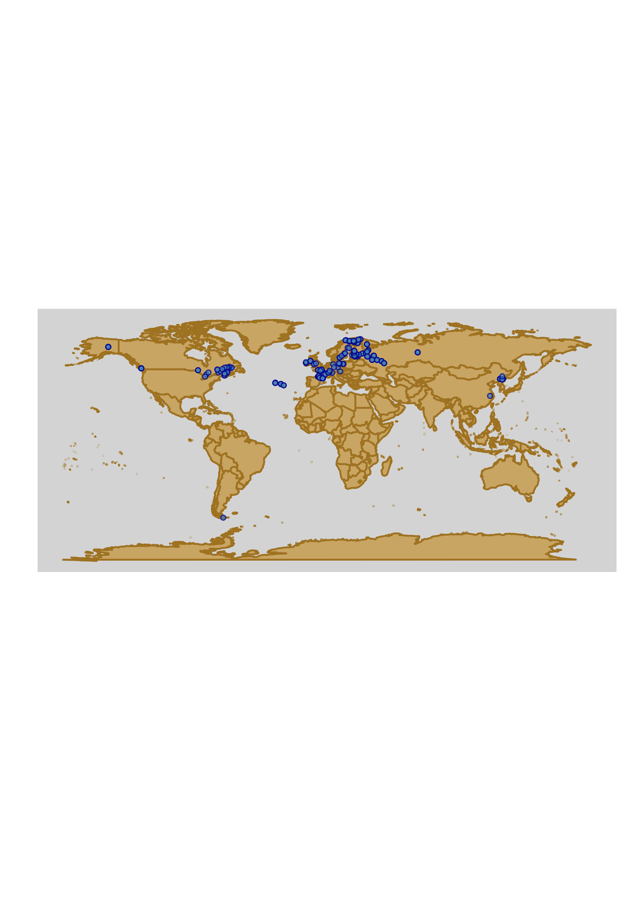

# MAPP project

The MAPP project aims to evaluate the contribution of peatlands micro-photoautotrophic organisms to the global C cycle.
To do so samples from >200 peatlands (summer 2021, mainly north hemisphere) were analyzed.

 - *On each sample*:
    * Metabarcoding (16s - bacteria/archae; 18s - Eukaryotes; 23s - photoautotrophs) - primers and expected length?
    * Bacteria and photoautotrophs abundances (cytometry)
    * Pigments concentration quantification
    * CO2/CH4 potential fluxes
    * Enzyme activity (C, N and P cycles; 4 enzymes)
    * Metabolomics
    * Decomposition rates
    
 - *Site metada*:
    * Coordinates
    * Sphagnum sp
    * Peatland type, sampling hour and sampler
    * Sph water content

- *Sample distribution*

